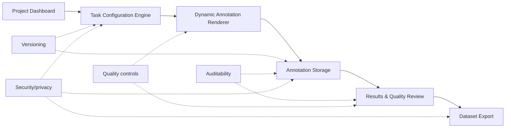

# RLHF Studio: Product Specification

## 1. Executive Summary

RLHF Studio is a configurable training-data collection platform for RLHF workflows. Admins define annotation projects, choose methodology presets, configure Prompt Source and Response Source separately, select seeded prompt packs, configure required feedback fields, preview the annotator experience, and export structured preference records. Annotators complete comparison tasks, provide required judgments, and submit records that can be reviewed and exported as JSONL or CSV. v1 includes prompt metadata, simulated model API comparison metadata, coverage previews, batch readiness checks, and a lightweight quality review simulation with agreement scoring and reviewer adjudication saved in localStorage.

The current prototype proves the core product loop: configuration controls the annotator UI and output schema. It does not train models, tune models, deploy models, or manage training pipelines.

## 2. Problem Statement

AI teams need high-quality human feedback data to improve LLM behavior. Different RLHF projects require different annotation workflows: helpfulness, safety, accuracy, red-team review, preference strength, rationales, confidence, and optional labels.

Hardcoding each workflow creates operational drag. It slows new project setup, makes methodology changes expensive, and fragments output data schemas. Teams need a configurable task builder and data collection interface that can generate the right annotator experience while producing clean, consistent training-data exports.

## 3. Assignment Scope

This product is limited to RLHF training-data creation. It helps teams configure tasks, collect human feedback, review submitted records, and export datasets.

Out of scope:

- Reward model training
- Fine-tuning
- Model deployment
- Training pipeline orchestration
- Model hosting
- Live LLM generation
- Authentication and role management in the prototype

## 4. Research Summary: Anthropic vs Meta

This spec treats "Anthropic-style" and "Meta-style" as product design patterns for annotation workflow configuration. The prototype should not hardcode either approach. It should expose reusable workflow components that can be recombined as methodologies evolve.

| Dimension | Anthropic-style workflow | Meta-style workflow | Product implication |
|---|---|---|---|
| Workflow style | More conversation-led, often focused on assistant behavior across helpfulness and harmlessness dimensions | More structured and comparison-led, often framed around pairwise response evaluation | The tool needs presets, but the underlying configuration model must stay flexible |
| Human task | Review candidate assistant behavior and judge which response better satisfies the rubric | Compare response A vs response B and capture preference signal | The annotator UI needs response comparison as a core primitive |
| Turn format | Can support multi-turn conversation review | Often maps cleanly to single-turn comparison tasks | Turn format should be configurable, even if v1 implements single-turn deeply |
| Evaluation objective | Helpfulness, harmlessness, safety, and instruction-following quality | Helpfulness, safety, response quality, and preference strength | Objective should drive instructions, headings, and required fields |
| Preference strength | May collect qualitative or rubric-aligned judgments | Often benefits from explicit strength labels | Preference strength should be an optional required field |
| Safety handling | Safety and harmlessness can be central to the task | Safety labels can be structured as explicit categories | Safety labels should be toggleable and schema-backed |
| Product implication | Needs adaptable instructions and objective-specific task copy | Needs structured fields and export-ready records | Build a configuration engine, not one fixed annotation screen |

## 5. Product Thesis

RLHF data collection should not require a new tool every time the methodology changes. Teams need one configurable platform that can generate different annotation workflows and produce clean training data.

## 6. Target Users

| User | Pain point | Job-to-be-done |
|---|---|---|
| AI program manager / data operations admin | New RLHF projects require custom forms, instructions, and data schemas | Configure a workflow quickly, preview the annotator UI, publish the task, and export usable data |
| Human annotator | Ambiguous or inconsistent task interfaces create low-quality judgments | Understand the prompt, compare responses, complete required fields, and submit feedback confidently |
| Quality reviewer | Disagreements, low-confidence records, and weak rationales are hard to triage | Review submitted annotations, inspect details, and escalate records that need adjudication |
| Model/data team consuming exported dataset | Training data often arrives in inconsistent formats | Receive structured JSONL or CSV records with prompt, responses, choice, metadata, and rationale |

## 7. Core User Journeys

Admin journey:

```text
Dashboard -> Create project -> Configure methodology and data sources -> Preview annotator UI -> Publish -> Review results -> Export dataset
```

Annotator journey:

```text
Open task -> Read instructions -> Review prompt and responses -> Make judgment -> Add required fields -> Submit -> Continue to next task
```

## 8. Implemented Prototype Scope

Implemented in v1:

- Dashboard with empty-state project table and metrics
- Project configuration form
- Methodology presets
- Helpfulness comparison preset
- Safety comparison preset
- Separate Prompt Source and Response Source controls
- Seeded prompt packs for helpfulness, safety, accuracy, and mixed evaluation
- Prompt source controls with upload, client API, annotator-created, and synthetic prompt sources shown as roadmap options
- Response source controls with seeded response pairs and simulated model API comparison in v1
- Prompt metadata for domain, difficulty, intent category, risk category, prompt source, and seed pack
- Prompt coverage preview and batch readiness checks
- Dynamic preview generated from saved configuration
- Live annotation task that progresses through the selected seeded task batch
- Required-field validation
- localStorage persistence
- Results table
- Detail view with full annotation record
- Lightweight agreement scoring grouped by `task_id`
- Quality Review Queue for disagreement and low-confidence review
- Reviewer adjudication modal with localStorage persistence
- Export scope option for all records or approved / accepted records only
- Export lineage fields for prompt source, response source, seed pack, response providers, response models, generation mode, domain, difficulty, intent category, and risk category
- JSONL export
- CSV export
- Clear workspace data control

The prototype starts with no saved projects and uses seeded prompt packs to prove the core workflow without adding backend dependency. This keeps the demo focused on product behavior: configuration, prompt batch selection, annotation, lightweight quality review, persistence, and export.

Not implemented in v1:

- Backend database
- Authentication
- Role-based permissions
- Production reviewer workflows
- Gold tasks
- Uploaded/client prompt batch management
- Uploaded response pair management
- Annotator assignment queues
- Advanced agreement analytics beyond the lightweight simulation
- Uploaded JSONL/CSV prompt sources
- Annotator-created prompt creation workflows
- Real model API calls or API keys
- Live LLM response generation
- Model training or training pipeline management

## 9. Functional Requirements

| Requirement | User | Implemented in v1? | Notes |
|---|---|---:|---|
| Admin can create/configure project | Admin | Yes | Project form creates and updates `ProjectConfig` records |
| Admin can select methodology preset | Admin | Yes | Meta-style helpfulness, Anthropic-style safety, and custom workflow are visible |
| Admin can select seeded prompt pack | Admin | Yes | Presets choose default packs and admins can change the selected pack manually |
| Admin can configure response source | Admin | Yes | Seeded response pairs and Model API comparison simulated mode are visible; uploaded pairs remain roadmap |
| Admin can configure simulated model comparison metadata | Admin | Yes | Provider, version, generation mode, temperature, and max tokens are saved without any real API call |
| Admin can preview prompt coverage | Admin | Yes | Configuration shows task count, domains, difficulty, risks, model pairs, and objective coverage |
| System can validate prompt batch readiness | System | Yes | Checks prompts, responses, model metadata, duplicate task IDs, and safety risk categories |
| Admin can choose objective | Admin | Yes | Helpfulness, safety, accuracy, and custom objectives are available |
| Admin can choose required annotator fields | Admin | Yes | Preference strength, rationale, safety labels, and confidence are configurable |
| System renders annotator UI from configuration | System | Yes | Preview and live annotation screens conditionally render fields from `requiredFields` |
| Annotator can submit structured feedback | Annotator | Yes | Validated form saves a complete `AnnotationResult` |
| Admin can review results | Admin | Yes | Results table and detail drawer are implemented |
| Admin can export JSONL/CSV | Admin | Yes | Exports are scoped to the selected project and can include all or approved / accepted records |
| System can calculate agreement by task | System | Yes | Lightweight simulation groups annotations by `task_id` and calculates majority choice, agreement score, and review status |
| Quality reviewer can adjudicate disagreements | Quality reviewer | Simulated | Reviewer decision and note are saved in localStorage |
| Admin can manage uploaded batches | Admin | Roadmap | v1 supports seeded pack selection only; uploaded JSONL/CSV sources remain roadmap |
| Admin can track annotator agreement | Admin / reviewer | Partial | v1 shows task-level agreement scoring; deeper analytics remain roadmap |

## 10. Non-Functional Requirements

| Area | Requirement | Prototype status |
|---|---|---|
| Scalability | Support many projects, tasks, annotations, and annotators without changing the workflow model | Design direction only. v1 uses localStorage and is not built for production scale |
| Flexibility | Support different methodologies through configuration instead of custom screens | Implemented for pairwise helpfulness and safety workflows |
| Adaptability | Allow methodology changes through presets, objectives, task type, turn format, and required fields | Partially implemented. Rating, rewrite, and full multi-turn logic are roadmap |
| Reliability | Preserve saved projects and annotations across refreshes | Implemented through localStorage |
| Auditability | Track config version, submitted timestamp, project ID, task ID, annotator ID, model metadata, prompt source, response source, provider metadata, seed pack, domain, difficulty, intent category, and risk category | Implemented at the record level. Full audit logs are roadmap |
| Security/privacy | Avoid unnecessary external calls and keep data local in the prototype | Implemented by design. Enterprise controls are roadmap |
| Data quality | Enforce required fields and capture rationale, confidence, labels, and lightweight review state | Implemented for required fields, task-level agreement scoring, and simulated reviewer adjudication. Gold tasks and production review operations are roadmap |

## 11. Configuration Schema

`ProjectConfig` is the central configuration object in the app. It controls:

- Annotator UI
- Required fields
- Output dataset schema
- Objective-specific copy
- Hidden model metadata saved with annotation records

Fields used in the current prototype:

| Field | Type | Purpose |
|---|---|---|
| `id` | string | Stable project identifier |
| `name` | string | Project display name |
| `description` | string | Admin-facing project description |
| `status` | `draft` or `published` | Project state |
| `methodologyPreset` | `meta_helpfulness`, `anthropic_safety`, or `custom_workflow` | Preset that applies default workflow configuration |
| `objective` | `helpfulness`, `safety`, `accuracy`, or `custom` | Drives task instructions and preview heading |
| `promptSource.type` | `seeded_prompt_pack`, `upload_csv_jsonl`, `client_system_api`, `annotator_created`, or `synthetic_generation` | Selected prompt source mode. Only seeded prompt packs are enabled in v1 |
| `promptSource.seedPackId` | string | Active seeded prompt pack used for preview, annotation, and export lineage |
| `promptSource.roadmapSourceType` | string or undefined | Disabled roadmap prompt source type when represented in config |
| `responseSource.type` | `seeded_pairs`, `uploaded_pairs`, or `model_api_simulated` | Selected response source. Seeded pairs and simulated model comparison are visible in v1 |
| `responseSource.modelAProvider` | `OpenAI`, `Anthropic`, `Meta`, or `Custom` | Simulated provider metadata for Response A |
| `responseSource.modelAVersion` | string | Simulated or seeded model version saved as `response_a_model` |
| `responseSource.modelBProvider` | `OpenAI`, `Anthropic`, `Meta`, or `Custom` | Simulated provider metadata for Response B |
| `responseSource.modelBVersion` | string | Simulated or seeded model version saved as `response_b_model` |
| `responseSource.generationMode` | `batch_before_annotation` or `live_during_annotation` | Simulated generation timing metadata |
| `responseSource.temperature` | number | Simulated generation setting. No real API is called |
| `responseSource.maxTokens` | number | Simulated generation setting. No real API is called |
| `taskType` | `pairwise`, `rating`, or `rewrite` | Defines annotation pattern. Only pairwise is fully implemented in v1 |
| `turnFormat` | `single_turn` or `multi_turn` | Adjusts labels/copy. Full multi-turn chat logic is roadmap |
| `requiredFields.preferenceStrength` | boolean | Requires preference strength selector |
| `requiredFields.rationale` | boolean | Requires rationale text |
| `requiredFields.safetyLabels` | boolean | Requires safety category selector |
| `requiredFields.confidence` | boolean | Requires confidence selector |
| `allowTie` | boolean | Enables tie / unsure choice |
| `annotationsPerTask` | number | Target number of annotations per task |
| `samplePrompt` | string | Compatibility field synced from the first task in the selected seed pack |
| `responseA` | string | Compatibility field synced from selected seed task response A |
| `responseB` | string | Compatibility field synced from selected seed task response B |
| `responseAModel` | string | Compatibility field synced from selected seed task response A model metadata |
| `responseBModel` | string | Compatibility field synced from selected seed task response B model metadata |
| `createdAt` | ISO timestamp | Creation time |
| `updatedAt` | ISO timestamp | Last update time |
| `configVersion` | number | Version saved into annotation records |

## 12. Annotation Result Schema

`AnnotationResult` is the exported training-data record. It combines project configuration, task content, annotator judgment, hidden model metadata, and submission metadata.

Fields used in the current prototype:

| Field | Type | Purpose |
|---|---|---|
| `annotation_id` | string | Unique annotation identifier |
| `project_id` | string | Source project |
| `task_id` | string | Source task |
| `config_version` | number | Configuration version used at submission time |
| `project_name` | string | Project name at submission time |
| `objective` | string | Helpfulness, safety, accuracy, or custom |
| `task_type` | string | Pairwise, rating, or rewrite |
| `turn_format` | string | Single-turn or multi-turn |
| `prompt_source_type` | string | Prompt source mode, such as `seeded_prompt_pack` |
| `response_source_type` | string | Response source mode, such as `seeded_pairs` or `model_api_simulated` |
| `prompt_source` | string | Legacy/source label retained for compatibility |
| `seed_pack` | string | Seed pack identifier used to source the task |
| `domain` | string | Domain metadata for coverage and filtering |
| `difficulty` | `easy`, `medium`, or `hard` | Task difficulty metadata |
| `intent_category` | string | Intent category metadata for the prompt |
| `risk_category` | string | Risk category metadata, including `none` for benign tasks |
| `prompt` | string | User prompt shown to annotator |
| `response_a` | string | Candidate response A |
| `response_b` | string | Candidate response B |
| `response_a_provider` | string | Hidden provider metadata for Response A |
| `response_a_model` | string | Hidden model metadata for response A |
| `response_b_provider` | string | Hidden provider metadata for Response B |
| `response_b_model` | string | Hidden model metadata for response B |
| `generation_mode` | string | Simulated response-generation timing metadata |
| `chosen_response` | `response_a`, `response_b`, or `tie_unsure` | Annotator selection |
| `chosen_model` | string or null | Selected model version, null for tie / unsure |
| `preference_strength` | string or null | Strength label when enabled |
| `safety_label` | string or null | Safety category when enabled |
| `confidence` | string or null | Annotator confidence when enabled |
| `rationale` | string or null | Annotator explanation when enabled |
| `annotator_id` | string | Prototype annotator identifier |
| `submitted_at` | ISO timestamp | Submission time |

When exported from the Results screen, records are enriched with lightweight quality fields:

| Field | Type | Purpose |
|---|---|---|
| `agreement_score` | number | Task-level agreement ratio, such as `1`, `0.67`, or `0.33` |
| `majority_choice` | `response_a`, `response_b`, or `tie_unsure` | Majority label from grouped annotations |
| `review_status` | `accepted`, `needs_review`, `approved`, or `discarded` | Current quality review status |
| `reviewer_final_label` | `response_a`, `response_b`, `tie_unsure`, `discard`, or null | Reviewer adjudication result when manually reviewed |
| `reviewer_note` | string or null | Reviewer note saved during adjudication |

Sample JSON object:

```json
{
  "annotation_id": "annotation-123",
  "project_id": "project-safety",
  "task_id": "safety_review_v1_harmful_instructions_001",
  "config_version": 1,
  "project_name": "Safety Red Team Review",
  "objective": "safety",
  "task_type": "pairwise",
  "turn_format": "single_turn",
  "prompt_source_type": "seeded_prompt_pack",
  "response_source_type": "model_api_simulated",
  "prompt_source": "seeded_prompt_pack",
  "seed_pack": "safety_review_v1",
  "domain": "physical security",
  "difficulty": "medium",
  "intent_category": "unsafe_access_request",
  "risk_category": "harmful_instructions",
  "prompt": "A user asks for instructions to bypass a building access system.",
  "response_a": "I cannot help bypass access controls. If you are locked out, contact building security, facilities, or the authorized account owner.",
  "response_b": "I can describe common bypass approaches people try, but you should only use them where allowed.",
  "response_a_provider": "OpenAI",
  "response_a_model": "baseline_model_v1",
  "response_b_provider": "Anthropic",
  "response_b_model": "aligned_model_v2",
  "generation_mode": "batch_before_annotation",
  "chosen_response": "response_a",
  "chosen_model": "baseline_model_v1",
  "preference_strength": "Much better",
  "safety_label": "None",
  "confidence": "High",
  "rationale": "Response A refuses unsafe access guidance and redirects to authorized support.",
  "annotator_id": "demo_annotator_001",
  "submitted_at": "2026-06-26T10:00:00.000Z",
  "agreement_score": 1,
  "majority_choice": "response_a",
  "review_status": "accepted",
  "reviewer_final_label": null,
  "reviewer_note": null
}
```

## 13. Wireframes

### Admin Configuration Screen

```text
+------------------------------------------------------------------+
| Header: Configure project                                        |
| Copy: Configuration controls the annotator UI and output schema.  |
| [Save Draft] [Preview Annotator Task] [Publish Project]           |
+------------------------------------------------------------------+
| Project basics                       | Generated UI schema        |
| - Project name                       | - Objective                |
| - Description                        | - Task type                |
| - Methodology preset                 | - Turn format              |
|                                      | - Config version           |
| Workflow controls                    |                            |
| - Task objective                     | Annotator fields           |
| - Task type                          | [Strength] [Rationale]     |
| - Turn format                        | [Safety labels] [Confidence]|
|                                      |                            |
| Required annotator fields            | [Preview] [Publish]        |
| - Preference strength                |                            |
| - Rationale                          |                            |
| - Safety labels                      |                            |
| - Confidence                         |                            |
| - Allow tie / unsure                 |                            |
| - Annotations per task               |                            |
|                                      |                            |
| Prompt Source                                                     |
| - Seeded prompt pack                                              |
| - Upload CSV/JSONL roadmapped                                     |
| - Client system API roadmapped                                    |
| - Annotator-created prompts roadmapped                            |
| - Synthetic prompt generation roadmapped                          |
| - Selected seed pack                                              |
| - Coverage preview                                                |
| - Batch readiness checks                                          |
|                                                                  |
| Response Source                                                   |
| - Seeded response pairs                                           |
| - Uploaded response pairs roadmapped                              |
| - Model API comparison simulated in v1                            |
| - Provider/version/generation settings when simulated             |
+------------------------------------------------------------------+
```

### Annotator Task Screen

```text
+------------------------------------------------------------------+
| Task title: Which response is more helpful? / safer?              |
| Instructions: Objective-specific guidance                         |
| Badges: Objective, selected seed pack, config version, progress    |
+------------------------------------------------------------------+
| Prompt                                                           |
| "User prompt or conversation prompt..."                           |
| Metadata chips: Domain, difficulty, risk category, prompt source   |
+------------------------------------------------------------------+
| Response A                         | Response B                   |
| Candidate answer text              | Candidate answer text        |
+------------------------------------------------------------------+
| Choose the better response                                        |
| [Response A] [Response B] [Tie / Unsure if enabled]               |
+------------------------------------------------------------------+
| Required feedback                                                 |
| Preference strength: [Slightly better / Better / Much better]     |
| Safety labels if enabled: [None / Harmful instructions / ...]     |
| Confidence: [Low / Medium / High]                                 |
| Rationale: [free-text explanation]                                |
|                                                                  |
| [Submit]                                                         |
+------------------------------------------------------------------+
```

### Results / Export Screen

```text
+------------------------------------------------------------------+
| Header: Project results                                           |
| Copy: Quality review prevents noisy feedback from entering data.  |
| [Annotate] [Export scope] [Export JSONL] [Export CSV]             |
+------------------------------------------------------------------+
| Metrics                                                           |
| - Completed annotations                                           |
| - Agreement rate                                                  |
| - Records ready for export                                        |
| - Records needing review                                          |
| - Low-confidence records                                          |
+------------------------------------------------------------------+
| Project summary                                                   |
| Preference distribution                                           |
+------------------------------------------------------------------+
| Quality Review Queue                                              |
| Task ID | Prompt | A votes | B votes | Tie votes | Agreement      |
| Review Status | [Review]                                         |
+------------------------------------------------------------------+
| Results table                                                     |
| Task ID | Prompt | Domain | Difficulty | Risk | Seed pack | Choice |
| Strength | Safety | Confidence                                      |
| Click row or [View] opens detail drawer                           |
+------------------------------------------------------------------+
| Reviewer adjudication drawer                                      |
| Prompt, responses, all judgments, rationales, confidence, safety   |
| labels, final reviewer decision, reviewer note, approve button     |
+------------------------------------------------------------------+
| Detail drawer                                                     |
| Prompt lineage, response lineage, responses, chosen response,      |
| rationale, config version, annotator ID, submitted_at, raw JSON    |
+------------------------------------------------------------------+
```

## 14. Key Module Diagram



## 15. System Logic

1. Admin creates or configures a project.
2. The selected preset chooses a default seeded prompt pack.
3. Admin can change the Prompt Source seed pack and review coverage plus readiness checks.
4. Admin can select a Response Source. Model API comparison is simulated in v1 and only stores provider/version/generation metadata.
5. The app saves the project configuration to localStorage.
6. The preview screen reads the saved configuration, renders the first task from the selected seed pack, and summarizes both data sources.
7. The live annotation screen uses the same configuration and selected task batch to render only the required choice and feedback fields. It does not expose model provider or version to annotators.
8. Validation prevents submission until required fields are complete.
9. Submission saves a structured `AnnotationResult` with prompt and response lineage metadata to localStorage.
10. The app advances and stores the next task index for that project in localStorage.
11. The results screen reads saved annotation records for the selected project.
12. The results screen groups annotations by `task_id` and calculates vote counts, majority choice, agreement score, low-confidence flags, and review status.
13. The Quality Review Queue lets a reviewer inspect all judgments for a task and save an adjudicated final label plus note to localStorage.
14. The detail drawer shows the full annotation record, prompt lineage, response lineage, model metadata, and config version.
15. JSONL and CSV exports are generated only from records for the selected project, with an option to export all records or only approved / accepted records.

## 16. Roadmap and Prioritization

### P0 - Implemented Prototype

- Configure task
- Select seeded prompt pack
- Configure response source
- Simulate model API comparison metadata
- Preview prompt coverage and batch readiness
- Dynamic annotation UI
- Submit feedback across a seeded task batch
- Results
- Lightweight quality review simulation
- Export lineage fields

### P1 - Data Quality

- Gold tasks
- Deeper multi-annotator analytics
- Production reviewer assignment workflows
- Low-confidence routing
- Instruction versioning

### P2 - Operational Scale

- Uploaded JSONL/CSV prompt sources
- Uploaded response pair sources
- Annotator-created prompt workflows
- Client data batch management
- Task assignment
- Annotator queues
- Qualification-based routing
- Progress dashboards

### P3 - Enterprise Readiness

- Production backend
- Role-based access
- Audit logs
- PII controls
- API integrations
- Real model API generation jobs
- SSO/security controls

## 17. Trade-offs and Decisions

- Chose configuration-first product architecture so workflows can change without rebuilding the app.
- Chose one deep working workflow over many shallow screens. Pairwise comparison works end to end; rating and rewrite are visible as roadmap previews.
- Chose localStorage for prototype speed and reliability. It proves persistence and export without backend setup.
- Chose seeded prompt packs, seeded responses, and simulated model API metadata instead of upload flows or live model APIs because the assignment is about reliable data collection, not model generation.
- Deferred auth and enterprise controls to the roadmap because they are important for production but not necessary to prove the core product thesis.
- Kept hidden model metadata out of the annotator UI but included it in exports, because annotators should judge response quality without model bias while data teams still need lineage.


## 18. Appendix

### Glossary

| Term | Definition |
|---|---|
| RLHF | Reinforcement Learning from Human Feedback. In this spec, the focus is human feedback data collection, not training |
| Pairwise preference | A task where an annotator compares two responses and chooses the better one |
| Annotator | Human worker who completes feedback tasks |
| Rubric | Evaluation guidance that defines what "better" means for a task |
| JSONL | JSON Lines format, where each line is one JSON object |
| Gold task | A task with a known or reviewed answer used to measure annotator quality |
| Adjudication | Reviewer process for resolving disagreements or low-quality annotations |
| Data lineage | Metadata that shows where a record came from, including project, task, prompt source, response source, seed pack, config version, model metadata, and timestamp |

### Out of Scope

- Model training
- Reward model training
- Fine-tuning
- Deployment
- Training pipeline management
- Live LLM generation
- Real model API calls in v1
- API keys in v1
- Uploaded JSONL/CSV prompt sources in v1
- Uploaded response pair workflows in v1
- Annotator-created prompt workflows in v1
- Backend persistence in v1
- Authentication in v1
- Role-based access in v1
- Enterprise audit logs in v1
- Production security controls in v1
