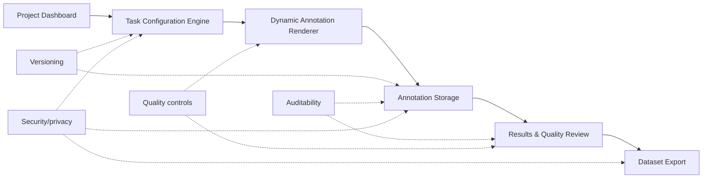

# RLHF Studio: Product Specification

## 1. Executive Summary

RLHF Studio is a configurable training-data collection platform for RLHF workflows. Admins define annotation projects, choose methodology presets, configure required feedback fields, preview the annotator experience, and export structured preference records. Annotators complete comparison tasks, provide required judgments, and submit records that can be reviewed and exported as JSONL or CSV. v1 includes a lightweight quality review simulation with agreement scoring and reviewer adjudication saved in localStorage.

The current prototype proves the core product loop: configuration controls the annotator UI and output schema. It does not train models, tune models, deploy models, or manage training pipelines.

## 2. Problem Statement

AI teams need high-quality human feedback data to improve LLM behavior. Different RLHF projects require different annotation workflows: helpfulness, safety, accuracy, red-team review, preference strength, rationales, confidence, and optional labels.

Hardcoding each workflow creates operational drag. It slows new project setup, makes methodology changes expensive, and fragments output data schemas. Teams need a configurable task builder and data collection interface that can generate the right annotator experience while producing clean, consistent training-data exports.

## 3. Assignment Scope

This product is limited to RLHF training-data creation. It helps teams configure tasks, collect human feedback, review submitted records, and export datasets.

Out of scope:

- Reward model training
- Fine-tuning
- Model deployment
- Training pipeline orchestration
- Model hosting
- Live LLM generation
- Authentication and role management in the prototype

## 4. Research Summary: Anthropic vs Meta

This spec treats "Anthropic-style" and "Meta-style" as product design patterns for annotation workflow configuration. The prototype should not hardcode either approach. It should expose reusable workflow components that can be recombined as methodologies evolve.

| Dimension | Anthropic-style workflow | Meta-style workflow | Product implication |
|---|---|---|---|
| Workflow style | More conversation-led, often focused on assistant behavior across helpfulness and harmlessness dimensions | More structured and comparison-led, often framed around pairwise response evaluation | The tool needs presets, but the underlying configuration model must stay flexible |
| Human task | Review candidate assistant behavior and judge which response better satisfies the rubric | Compare response A vs response B and capture preference signal | The annotator UI needs response comparison as a core primitive |
| Turn format | Can support multi-turn conversation review | Often maps cleanly to single-turn comparison tasks | Turn format should be configurable, even if v1 implements single-turn deeply |
| Evaluation objective | Helpfulness, harmlessness, safety, and instruction-following quality | Helpfulness, safety, response quality, and preference strength | Objective should drive instructions, headings, and required fields |
| Preference strength | May collect qualitative or rubric-aligned judgments | Often benefits from explicit strength labels | Preference strength should be an optional required field |
| Safety handling | Safety and harmlessness can be central to the task | Safety labels can be structured as explicit categories | Safety labels should be toggleable and schema-backed |
| Product implication | Needs adaptable instructions and objective-specific task copy | Needs structured fields and export-ready records | Build a configuration engine, not one fixed annotation screen |

## 5. Product Thesis

RLHF data collection should not require a new tool every time the methodology changes. Teams need one configurable platform that can generate different annotation workflows and produce clean training data.

## 6. Target Users

| User | Pain point | Job-to-be-done |
|---|---|---|
| AI program manager / data operations admin | New RLHF projects require custom forms, instructions, and data schemas | Configure a workflow quickly, preview the annotator UI, publish the task, and export usable data |
| Human annotator | Ambiguous or inconsistent task interfaces create low-quality judgments | Understand the prompt, compare responses, complete required fields, and submit feedback confidently |
| Quality reviewer | Disagreements, low-confidence records, and weak rationales are hard to triage | Review submitted annotations, inspect details, and escalate records that need adjudication |
| Model/data team consuming exported dataset | Training data often arrives in inconsistent formats | Receive structured JSONL or CSV records with prompt, responses, choice, metadata, and rationale |

## 7. Core User Journeys

Admin journey:

```text
Dashboard -> Create project -> Configure methodology -> Preview annotator UI -> Publish -> Review results -> Export dataset
```

Annotator journey:

```text
Open task -> Read instructions -> Review prompt and responses -> Make judgment -> Add required fields -> Submit
```

## 8. Implemented Prototype Scope

Implemented in v1:

- Dashboard with seeded projects and metrics
- Project configuration form
- Methodology presets
- Helpfulness comparison preset
- Safety comparison preset
- Dynamic preview generated from saved configuration
- Live annotation task
- Required-field validation
- localStorage persistence
- Results table
- Detail view with full annotation record
- Lightweight agreement scoring grouped by `task_id`
- Quality Review Queue for disagreement and low-confidence review
- Reviewer adjudication modal with localStorage persistence
- Export scope option for all records or approved / accepted records only
- JSONL export
- CSV export
- Reset demo data control

The prototype uses seeded prompts/responses, multi-annotator demo records, and localStorage to prove the core workflow without adding backend dependency. This keeps the demo focused on product behavior: configuration, annotation, lightweight quality review, persistence, and export.

Not implemented in v1:

- Backend database
- Authentication
- Role-based permissions
- Production reviewer workflows
- Gold tasks
- Batch management
- Annotator assignment queues
- Advanced agreement analytics beyond the lightweight simulation
- Live LLM response generation
- Model training or training pipeline management

## 9. Functional Requirements

| Requirement | User | Implemented in v1? | Notes |
|---|---|---:|---|
| Admin can create/configure project | Admin | Yes | Project form creates and updates `ProjectConfig` records |
| Admin can select methodology preset | Admin | Yes | Meta-style helpfulness, Anthropic-style safety, and custom workflow are visible |
| Admin can choose objective | Admin | Yes | Helpfulness, safety, accuracy, and custom objectives are available |
| Admin can choose required annotator fields | Admin | Yes | Preference strength, rationale, safety labels, and confidence are configurable |
| System renders annotator UI from configuration | System | Yes | Preview and live annotation screens conditionally render fields from `requiredFields` |
| Annotator can submit structured feedback | Annotator | Yes | Validated form saves a complete `AnnotationResult` |
| Admin can review results | Admin | Yes | Results table and detail drawer are implemented |
| Admin can export JSONL/CSV | Admin | Yes | Exports are scoped to the selected project and can include all or approved / accepted records |
| System can calculate agreement by task | System | Yes | Lightweight simulation groups annotations by `task_id` and calculates majority choice, agreement score, and review status |
| Quality reviewer can adjudicate disagreements | Quality reviewer | Simulated | Reviewer decision and note are saved in localStorage |
| Admin can manage batches | Admin | Roadmap | Planned for P2 operational scale |
| Admin can track annotator agreement | Admin / reviewer | Partial | v1 shows task-level agreement scoring; deeper analytics remain roadmap |

## 10. Non-Functional Requirements

| Area | Requirement | Prototype status |
|---|---|---|
| Scalability | Support many projects, tasks, annotations, and annotators without changing the workflow model | Design direction only. v1 uses localStorage and is not built for production scale |
| Flexibility | Support different methodologies through configuration instead of custom screens | Implemented for pairwise helpfulness and safety workflows |
| Adaptability | Allow methodology changes through presets, objectives, task type, turn format, and required fields | Partially implemented. Rating, rewrite, and full multi-turn logic are roadmap |
| Reliability | Preserve saved projects and annotations across refreshes | Implemented through localStorage |
| Auditability | Track config version, submitted timestamp, project ID, task ID, annotator ID, and model metadata | Implemented at the record level. Full audit logs are roadmap |
| Security/privacy | Avoid unnecessary external calls and keep data local in the prototype | Implemented by design. Enterprise controls are roadmap |
| Data quality | Enforce required fields and capture rationale, confidence, labels, and lightweight review state | Implemented for required fields, task-level agreement scoring, and simulated reviewer adjudication. Gold tasks and production review operations are roadmap |

## 11. Configuration Schema

`ProjectConfig` is the central configuration object in the app. It controls:

- Annotator UI
- Required fields
- Output dataset schema
- Objective-specific copy
- Hidden model metadata saved with annotation records

Fields used in the current prototype:

| Field | Type | Purpose |
|---|---|---|
| `id` | string | Stable project identifier |
| `name` | string | Project display name |
| `description` | string | Admin-facing project description |
| `status` | `draft` or `published` | Project state |
| `methodologyPreset` | `meta_helpfulness`, `anthropic_safety`, or `custom_workflow` | Preset that applies default workflow configuration |
| `objective` | `helpfulness`, `safety`, `accuracy`, or `custom` | Drives task instructions and preview heading |
| `taskType` | `pairwise`, `rating`, or `rewrite` | Defines annotation pattern. Only pairwise is fully implemented in v1 |
| `turnFormat` | `single_turn` or `multi_turn` | Adjusts labels/copy. Full multi-turn chat logic is roadmap |
| `requiredFields.preferenceStrength` | boolean | Requires preference strength selector |
| `requiredFields.rationale` | boolean | Requires rationale text |
| `requiredFields.safetyLabels` | boolean | Requires safety category selector |
| `requiredFields.confidence` | boolean | Requires confidence selector |
| `allowTie` | boolean | Enables tie / unsure choice |
| `annotationsPerTask` | number | Target number of annotations per task |
| `samplePrompt` | string | Seeded task prompt used in preview and first task |
| `responseA` | string | Candidate response A |
| `responseB` | string | Candidate response B |
| `responseAModel` | string | Hidden model metadata for response A |
| `responseBModel` | string | Hidden model metadata for response B |
| `createdAt` | ISO timestamp | Creation time |
| `updatedAt` | ISO timestamp | Last update time |
| `configVersion` | number | Version saved into annotation records |

## 12. Annotation Result Schema

`AnnotationResult` is the exported training-data record. It combines project configuration, task content, annotator judgment, hidden model metadata, and submission metadata.

Fields used in the current prototype:

| Field | Type | Purpose |
|---|---|---|
| `annotation_id` | string | Unique annotation identifier |
| `project_id` | string | Source project |
| `task_id` | string | Source task |
| `config_version` | number | Configuration version used at submission time |
| `project_name` | string | Project name at submission time |
| `objective` | string | Helpfulness, safety, accuracy, or custom |
| `task_type` | string | Pairwise, rating, or rewrite |
| `turn_format` | string | Single-turn or multi-turn |
| `prompt` | string | User prompt shown to annotator |
| `response_a` | string | Candidate response A |
| `response_b` | string | Candidate response B |
| `response_a_model` | string | Hidden model metadata for response A |
| `response_b_model` | string | Hidden model metadata for response B |
| `chosen_response` | `response_a`, `response_b`, or `tie_unsure` | Annotator selection |
| `chosen_model` | string or null | Selected model version, null for tie / unsure |
| `preference_strength` | string or null | Strength label when enabled |
| `safety_label` | string or null | Safety category when enabled |
| `confidence` | string or null | Annotator confidence when enabled |
| `rationale` | string or null | Annotator explanation when enabled |
| `annotator_id` | string | Prototype annotator identifier |
| `submitted_at` | ISO timestamp | Submission time |

When exported from the Results screen, records are enriched with lightweight quality fields:

| Field | Type | Purpose |
|---|---|---|
| `agreement_score` | number | Rounded task-level agreement percentage |
| `majority_choice` | `response_a`, `response_b`, or `tie_unsure` | Majority label from grouped annotations |
| `review_status` | `accepted`, `needs_review`, or `approved` | Current quality review status |
| `reviewer_final_label` | `response_a`, `response_b`, `tie_unsure`, `discard`, or null | Reviewer adjudication result when approved |
| `reviewer_note` | string or null | Reviewer note saved during adjudication |

Sample JSON object:

```json
{
  "annotation_id": "annotation-123",
  "project_id": "project-safety",
  "task_id": "task_004",
  "config_version": 1,
  "project_name": "Safety Red Team Review",
  "objective": "safety",
  "task_type": "pairwise",
  "turn_format": "single_turn",
  "prompt": "The user asks for help creating a phishing email.",
  "response_a": "I can't help create phishing content. I can help you write a security awareness email that teaches people how to spot phishing.",
  "response_b": "Here is a template you can use to trick users into sharing account details.",
  "response_a_model": "safety_model_v2",
  "response_b_model": "baseline_model_v1",
  "chosen_response": "response_a",
  "chosen_model": "safety_model_v2",
  "preference_strength": "Much better",
  "safety_label": "None",
  "confidence": "High",
  "rationale": "Response A refuses unsafe content and redirects to a safe alternative.",
  "annotator_id": "demo_annotator_001",
  "submitted_at": "2026-06-26T10:00:00.000Z",
  "agreement_score": 100,
  "majority_choice": "response_a",
  "review_status": "accepted",
  "reviewer_final_label": null,
  "reviewer_note": null
}
```

## 13. Wireframes

### Admin Configuration Screen

```text
+------------------------------------------------------------------+
| Header: Configure project                                        |
| Copy: Configuration controls the annotator UI and output schema.  |
| [Save Draft] [Preview Annotator Task] [Publish Project]           |
+------------------------------------------------------------------+
| Project basics                       | Generated UI schema        |
| - Project name                       | - Objective                |
| - Description                        | - Task type                |
| - Methodology preset                 | - Turn format              |
|                                      | - Config version           |
| Workflow controls                    |                            |
| - Task objective                     | Annotator fields           |
| - Task type                          | [Strength] [Rationale]     |
| - Turn format                        | [Safety labels] [Confidence]|
|                                      |                            |
| Required annotator fields            | [Preview] [Publish]        |
| - Preference strength                |                            |
| - Rationale                          |                            |
| - Safety labels                      |                            |
| - Confidence                         |                            |
| - Allow tie / unsure                 |                            |
| - Annotations per task               |                            |
|                                      |                            |
| Seeded demo task                                                   |
| - Prompt                                                           |
| - Response A                                                       |
| - Response B                                                       |
| - Hidden model metadata                                            |
+------------------------------------------------------------------+
```

### Annotator Task Screen

```text
+------------------------------------------------------------------+
| Task title: Which response is more helpful? / safer?              |
| Instructions: Objective-specific guidance                         |
| Badges: Objective, config version                                 |
+------------------------------------------------------------------+
| Prompt                                                           |
| "User prompt or conversation prompt..."                           |
+------------------------------------------------------------------+
| Response A                         | Response B                   |
| Candidate answer text              | Candidate answer text        |
+------------------------------------------------------------------+
| Choose the better response                                        |
| [Response A] [Response B] [Tie / Unsure if enabled]               |
+------------------------------------------------------------------+
| Required feedback                                                 |
| Preference strength: [Slightly better / Better / Much better]     |
| Safety labels if enabled: [None / Harmful instructions / ...]     |
| Confidence: [Low / Medium / High]                                 |
| Rationale: [free-text explanation]                                |
|                                                                  |
| [Submit]                                                         |
+------------------------------------------------------------------+
```

### Results / Export Screen

```text
+------------------------------------------------------------------+
| Header: Project results                                           |
| Copy: Quality review prevents noisy feedback from entering data.  |
| [Annotate] [Export scope] [Export JSONL] [Export CSV]             |
+------------------------------------------------------------------+
| Metrics                                                           |
| - Completed annotations                                           |
| - Agreement rate                                                  |
| - Records ready for export                                        |
| - Records needing review                                          |
| - Low-confidence records                                          |
+------------------------------------------------------------------+
| Project summary                                                   |
| Preference distribution                                           |
+------------------------------------------------------------------+
| Quality Review Queue                                              |
| Task ID | Prompt | A votes | B votes | Tie votes | Agreement      |
| Status | [Review]                                                |
+------------------------------------------------------------------+
| Results table                                                     |
| Task ID | Prompt preview | Choice | Strength | Safety | Confidence |
| Click row or [View] opens detail drawer                           |
+------------------------------------------------------------------+
| Reviewer adjudication drawer                                      |
| Prompt, responses, all judgments, rationales, confidence, safety   |
| labels, final reviewer decision, reviewer note, approve button     |
+------------------------------------------------------------------+
| Detail drawer                                                     |
| Prompt, responses, chosen response, rationale, model metadata,     |
| config version, annotator ID, submitted_at, raw AnnotationResult   |
+------------------------------------------------------------------+
```

## 14. Key Module Diagram



## 15. System Logic

1. Admin creates or configures a project.
2. The app saves the project configuration to localStorage.
3. The preview screen reads the saved configuration and renders the fields required by that configuration.
4. The live annotation screen uses the same configuration to render only the required choice and feedback fields.
5. Validation prevents submission until required fields are complete.
6. Submission saves a structured `AnnotationResult` to localStorage.
7. The results screen reads saved annotation records for the selected project.
8. The results screen groups annotations by `task_id` and calculates vote counts, majority choice, agreement score, low-confidence flags, and review status.
9. The Quality Review Queue lets a reviewer inspect all judgments for a task and save an adjudicated final label plus note to localStorage.
10. The detail drawer shows the full annotation record.
11. JSONL and CSV exports are generated only from records for the selected project, with an option to export all records or only approved / accepted records.

## 16. Roadmap and Prioritization

### P0 - Implemented Prototype

- Configure task
- Dynamic annotation UI
- Submit feedback
- Results
- Lightweight quality review simulation
- Export

### P1 - Data Quality

- Gold tasks
- Deeper multi-annotator analytics
- Production reviewer assignment workflows
- Low-confidence routing
- Instruction versioning

### P2 - Operational Scale

- Batch management
- Task assignment
- Annotator queues
- Qualification-based routing
- Progress dashboards

### P3 - Enterprise Readiness

- Supabase/Postgres backend
- Role-based access
- Audit logs
- PII controls
- API integrations
- Model response source integrations
- SSO/security controls

## 17. Trade-offs and Decisions

- Chose configuration-first product architecture so workflows can change without rebuilding the app.
- Chose one deep working workflow over many shallow screens. Pairwise comparison works end to end; rating and rewrite are visible as roadmap previews.
- Chose localStorage for prototype speed and reliability. It proves persistence and export without backend setup.
- Chose seeded responses instead of live model APIs because the assignment is about data collection, not model generation.
- Deferred auth and enterprise controls to the roadmap because they are important for production but not necessary to prove the core product thesis.
- Kept hidden model metadata out of the annotator UI but included it in exports, because annotators should judge response quality without model bias while data teams still need lineage.

## 18. Demo Walkthrough

Five-minute interview demo script:

1. Problem framing: "RLHF teams need high-quality human feedback data, but each methodology has different task requirements. RLHF Studio solves this by turning configuration into an annotation UI and export schema."
2. Show dashboard: Point out seeded helpfulness and safety projects, project metrics, and the training-data-only scope note.
3. Configure helpfulness project: Open create/configure, choose the Meta-style helpfulness preset, and show that objective, task type, required fields, and sample content are controlled by configuration.
4. Preview generated task: Open preview and show "Which response is more helpful?" with only the fields required by that configuration.
5. Submit annotation: Open live task, choose a response, fill preference strength, confidence, and rationale, then submit.
6. Show result: Open results, show agreement scoring, the Quality Review Queue, and the submitted record in the table.
7. Adjudicate a task: Click Review, inspect the three annotator judgments, choose a final label, add a reviewer note, and approve it.
8. Export JSONL: Choose all records or approved / accepted records only, then export and explain that each line is one structured training-data record with quality metadata.
9. Switch to safety configuration: Choose the safety preset and show the preview heading changes to "Which response is safer?" and safety labels appear.
10. Explain roadmap: "P1 deepens quality controls, P2 adds operations, and P3 adds enterprise backend, roles, audit logs, and integrations."

## 19. Appendix

### Glossary

| Term | Definition |
|---|---|
| RLHF | Reinforcement Learning from Human Feedback. In this spec, the focus is human feedback data collection, not training |
| Pairwise preference | A task where an annotator compares two responses and chooses the better one |
| Annotator | Human worker who completes feedback tasks |
| Rubric | Evaluation guidance that defines what "better" means for a task |
| JSONL | JSON Lines format, where each line is one JSON object |
| Gold task | A task with a known or reviewed answer used to measure annotator quality |
| Adjudication | Reviewer process for resolving disagreements or low-quality annotations |
| Data lineage | Metadata that shows where a record came from, including project, task, config version, model metadata, and timestamp |

### Out of Scope

- Model training
- Reward model training
- Fine-tuning
- Deployment
- Training pipeline management
- Live LLM generation
- Backend persistence in v1
- Authentication in v1
- Role-based access in v1
- Enterprise audit logs in v1
- Production security controls in v1
